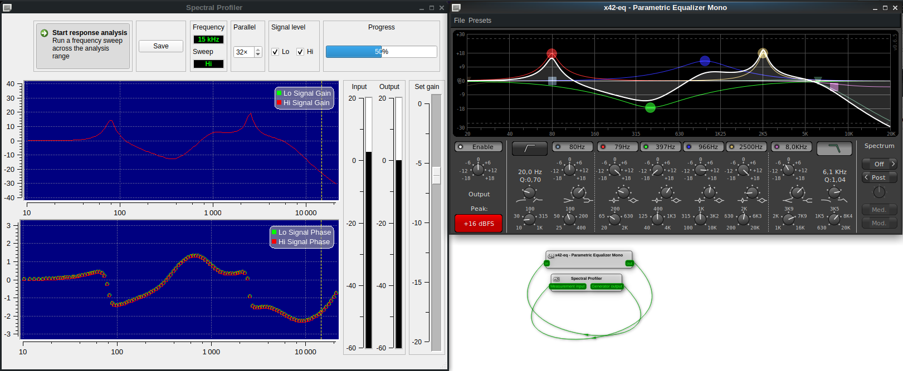

# spectral-profiler
Real-time frequency response analyzer for JACK

The Spectral Profiler can dynamically extract a frequency response from an audio system, either software or hardware.

The system is a JACK client 1-in 1-out, and it connects to the analyzer software using a loop.

The profiler operates by sending a sine sweep to the audio system, and calculating the transfer at all frequency points in the spectrum.
The capture shows the Spectral Profiler in action:

The analysis is intended to have some support for non-LTI systems.
It can do two sweeps in turn: a *High* sweep set at 0 dBFS, and a *Low* sweep set at -40 dBFS.
This optional feature can be used to observe effect of non-linearity, and it can be calibrated using a global gain slider.

The analyzer also supports speeding up the analysis, up to 32×, by sweeping multiple sines in one go.
The *Parallel* setting controls this behavior, but it may degrade analysis quality in some cases.

Upon completion of the measurement, the data can be recorded to files for use with numerical analysis tools.
